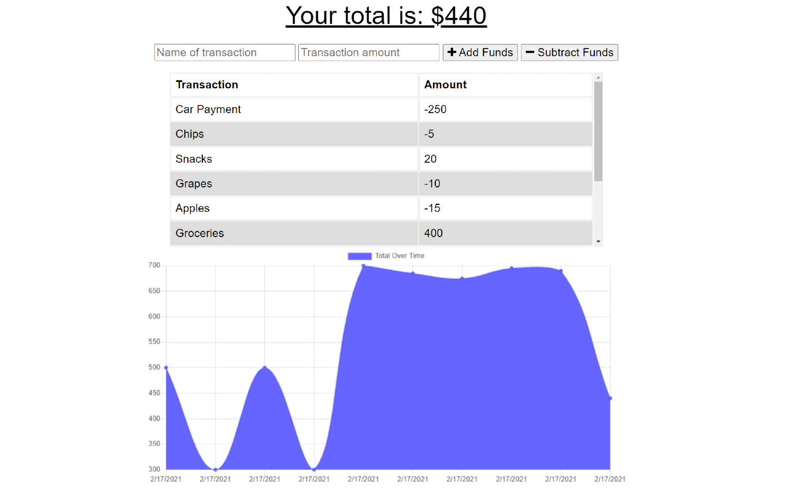

# Budget_Tracker
## Description

The Budget Tracker is an app that allows users to track their transactions to help establish a more organized budget. The app is easy to use as users can add money to their budget and then subtract transactions as their budget is spent. A line graph of the user’s transactions is also displayed for visualization and further organization. This project uses Express.JS for establishing API routes as well as MongoDB as its database. On the front end, this app is developed through HTML, CSS, JavaScript and chart.js. In case the user was to go offline, I was responsible for syncing the app through IndexDB so that the user can still utilize the app while not online. Once the user is back online, their pending transactions will update automatically and will continue to be stored through MongoDB. I was also responsible for deploying the website and MongoDB database through Heroku.

## Table of Contents

* [License](#license)
* [Contributing](#contributing)
* [Screenshot](#screenshot)
* [Link](#link)
* [Questions](#questions)

## License

MIT

## Contributing

Ianaac27

Trilogy Education Services

# Screenshot
Here is a mock of the Budget Tracker.

# Link
Take a look at the live version through Heroku [here.](https://budget-tracker-ifc.herokuapp.com/)
